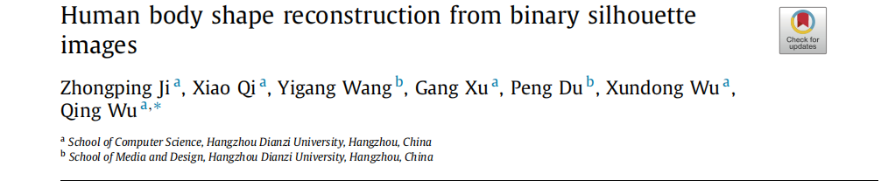
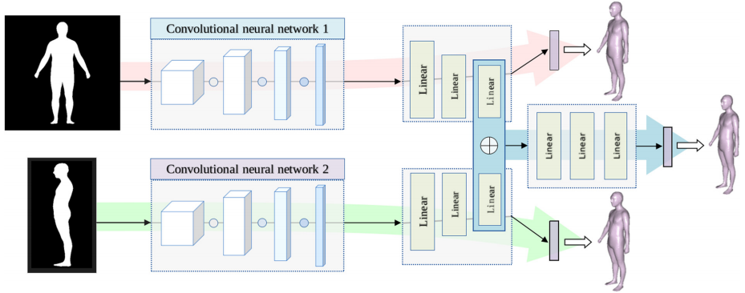
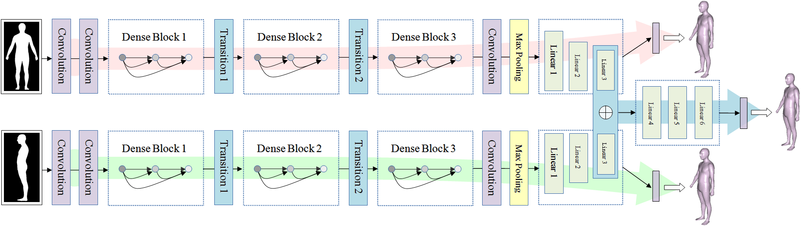
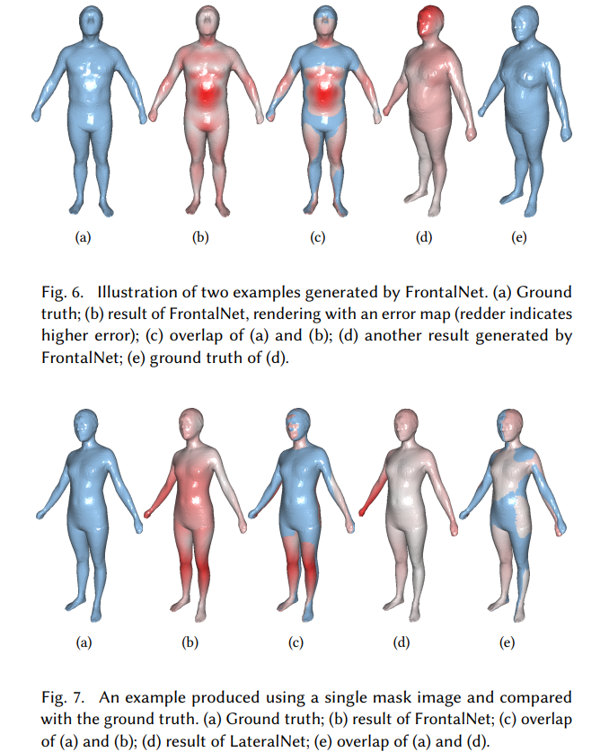
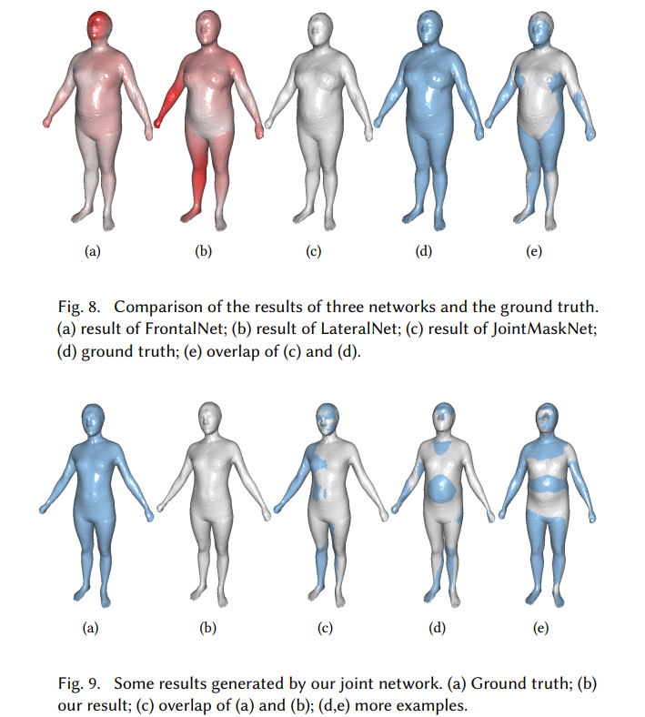
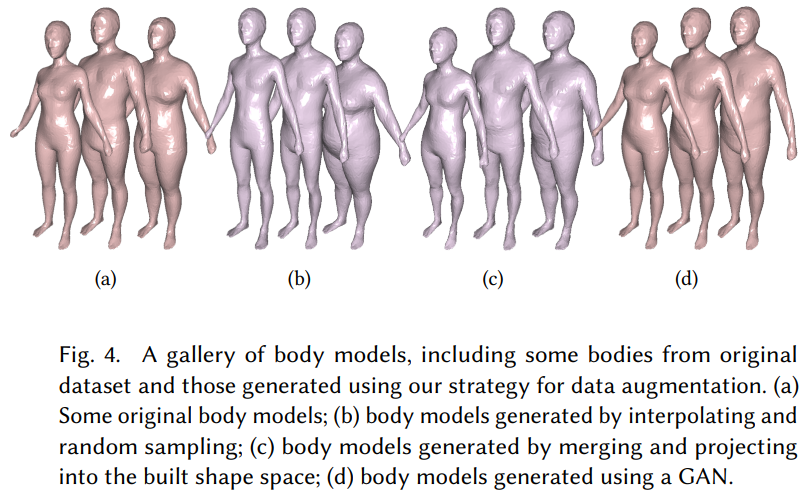

This is the official repository for **Human Body Shape Reconstruction from Binary Silhouette Images**.


## Introduction



3D content creation is a core task in computer graphics, with numerous algorithms developed over the years to model 3D shapes from 2D images or curves. These methods allow designers to create 3D models by aligning conceptual images or sketching curves from various views. Our paper introduces a deep learning approach for reconstructing 3D human body shapes from 2D silhouette images. We designed a CNN-based regression network with two branches for frontal and lateral views to estimate body shapes from silhouettes. Training these networks separately and then fusing their outputs improves accuracy. To address the lack of training data, we propose data augmentation strategies for 3D body shapes. Our method, requiring just one or two silhouettes, enables quick digital avatar creation and facilitates 3D gaming, VR, and online fashion. Experimental results confirm the visual realism and accuracy of our reconstructions.

For details, please refer to our paper [Human body shape reconstruction from binary silhouette images](https://www.sciencedirect.com/science/article/abs/pii/S0167839619300354).

## Architecture



Figure 2. Illustration of our network architecture for human body reconstruction with two-view masks. Our network is composed of several dense blocks. It is allowed to perform by passing through two separate pipelines starting from a single frontal mask (along the direction of light red arrow) or from a single lateral mask (along the direction of light green arrow). And the joint pipeline is conducted by concatenating the feature descriptors in the light blue box and goes forward along the direction of light blue arrow.

## Results







## Dataset




#### The dataset is coming soon.


## Citation

If you find our work or Dataset useful to your research, please consider citing:


```bash
@article{JI2019231,
title = {Human body shape reconstruction from binary silhouette images},
journal = {Computer Aided Geometric Design},
volume = {71},
pages = {231-243},
year = {2019},
issn = {0167-8396},
doi = {https://doi.org/10.1016/j.cagd.2019.04.019},
url = {https://www.sciencedirect.com/science/article/pii/S0167839619300354},
author = {Zhongping Ji and Xiao Qi and Yigang Wang and Gang Xu and Peng Du and Xundong Wu and Qing Wu}
}
```
